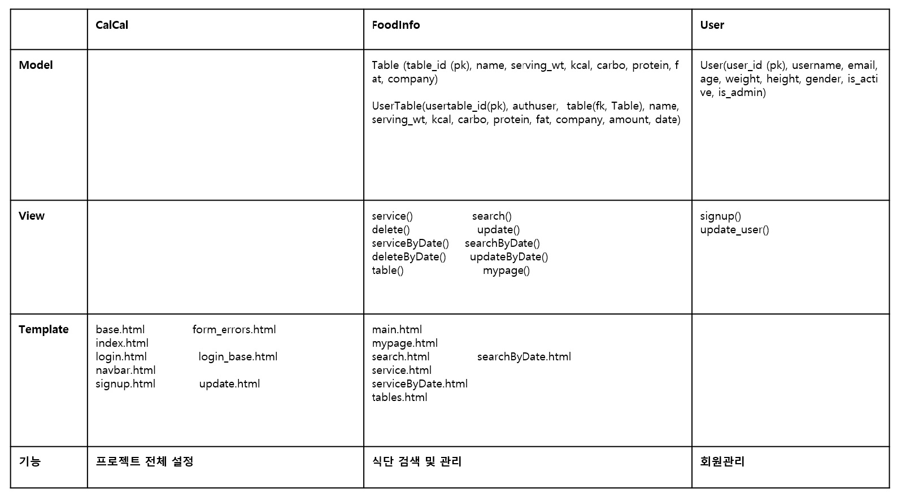
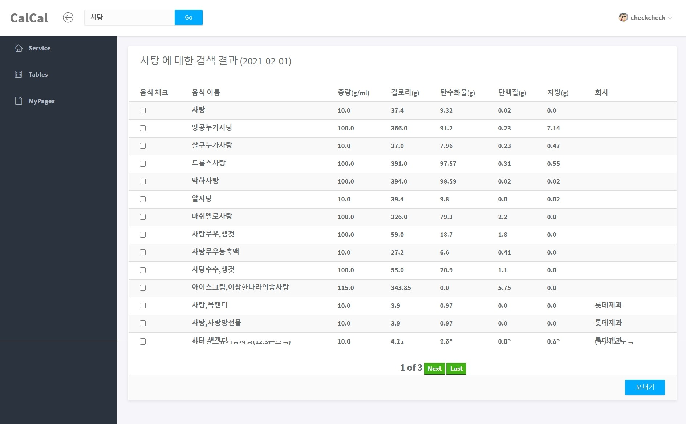
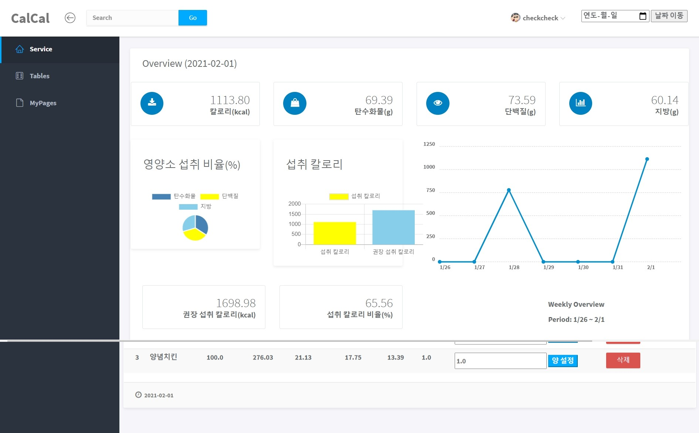
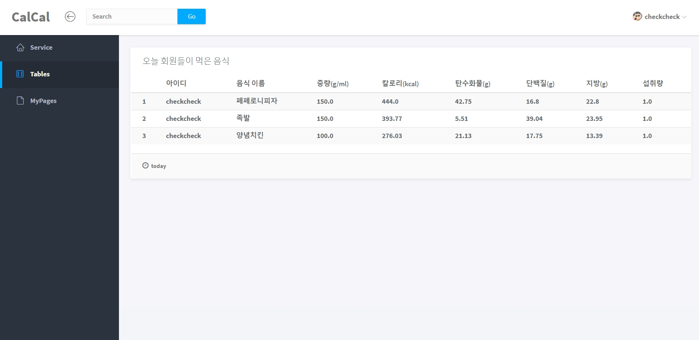

# CalCal project

* 사용자에게 정확한 식품 영양 성분 정보를 제공하기 위한 Web Application

* 다이어트 목적의 식단 조절 인구 증가 및 환자를 위한 예방/치료 목적의 식단을 위해서라도

  식품 영양 성분에 대한 정확한 정보 제공이 필요

# 개요

##### [융복합 프로젝트형] AI 서비스 개발과정 1차 팀 프로젝트

* 작업 기간

  * 2020.08.10 ~ 2020.09.04
  * 위 기간 중 10일 총 80시간

  

* 활용 데이터

  * 공공데이터 [식품 영양 성분 서비스](https://www.data.go.kr/data/15057436/openapi.do) API 

    (22602개의 데이터)

  

* 프로젝트 수행 도구
  * Python/Django
  * Pycharm
  * SQL

# 구조

# 주요 기능

1. 식품 검색 및 해당 식품의 영양 성분 정보 제공 기능

2. 섭취한 식품 영양 성분에 대한 일별통계 및 주간통계를 시각화

3. 오늘에 한해 user들의 섭취 목록 확인 기능

4. 신체 정보 수정 및 신체 정보 수정에 따른 권장 섭취 칼로리 연동

5. 과거 섭취 이력 조회 및 수정 기능

# 개선점

* 권장 섭취 칼로리 미달 시 알림 제공

# 서버 배포 및 PPT 파일

* https://calcal2020.herokuapp.com
* [PPT](./CalCal_김주현,서광채,한현도.pptx)
